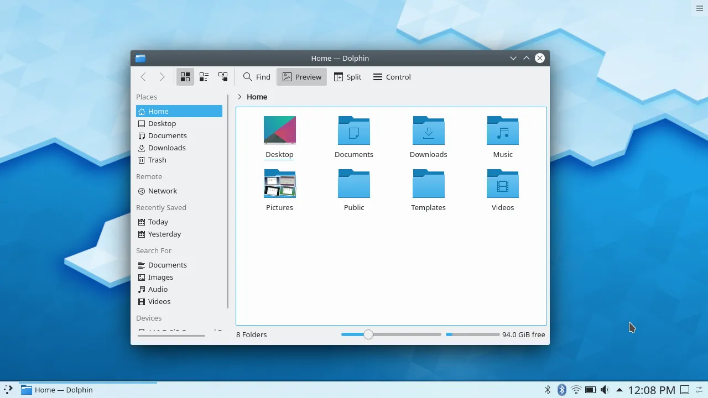

# Desktop Environment and Customizations

<h6> I use KDE Plasma with some customizations </h6>

# INSTALLING KDE
<h6> To install KDE you need to type the following commands depending on what Distro you're using </h6>

<h3> Ubuntu Based Distros </h3>

```
sudo apt install kde-standard
```

<h3> Arch Based Systems </h3>

```
sudo pacman -S xorg plasma plasma-wayland-session kde-applications
```

(I think this is all the packages I havn't installed KDE in a while. Create a Pull Request and correct and mistakes I made if there is any)

<h4> If you want me to add another distro here let me know in the issues tab. (You could just google it but let me know)

<h5> If you have installed it successfully the default KDE Theme should look like this


